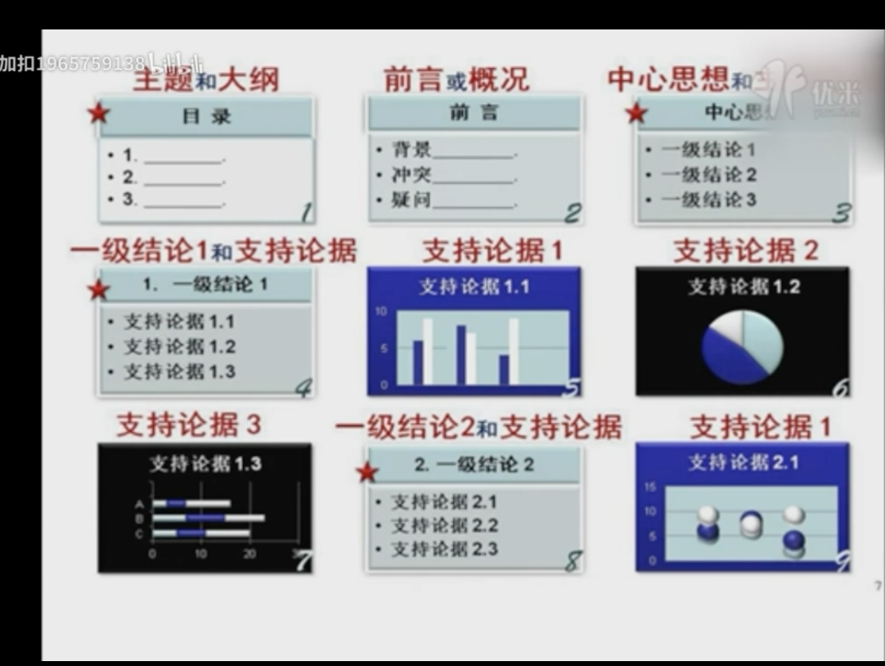

# 金字塔原理

Original Video: https://www.bilibili.com/video/BV16s411u7FH?p=16&spm_id_from=pageDriver

## 原理概述

逻辑清晰

- 结论先行
-  以上统下 
- 归类分组 
- 逻辑递进
- 先重要 全局 总结 论点 结论 结果 后次要 细节 具体 论据 原因 过程

揣摩心理， 迎合诉求

- 以受众为中心，
-  体会老板意图，
-  关注点需求点利益点

达到沟通4大目的

- 观点鲜明
- 重点突出
- 逻辑清晰
- 主次分明
- 思考力 号召力 影响力

结构化系统思维

- 纵向： 自上而下，自下而上
- 横向： 演绎归纳，STAR，用演示说话

先做人，后做事

1. 感性做人，理性做事；感性切入，理性回归；攻心为上，攻城为下
2. 要话先说，要事先做
3. 选择题，判断题 而非 问答题 填空题
   1. 3个解决方案+优先级

## 单一思想统领金字塔结构

一级思想（中心思想），二级思想，三级思想

1. ***听众想听什么，你就讲什么而非你讲什么，听众就听什么***

2. 首先迎合最重要的人，不确定时，迎合50%的人

例：先产品发布会：用户，媒体，政府，上司，优先满足用户，媒体，政府诉求

用户关心：功能，性能，性价比，方便，稳定，安全可靠

媒体关心：创新性，新闻性，噱头，炒作，话题性

政府关心：GDP，环保，政绩

## 逻辑清晰，四个原则

1. 结论先行
   1. 只有一个中心思想，放在最前面
2. 以上统下
   1. 上对下总结概括
   2. 下对上解释支撑
   3. 父子关系
3. 归类分组
   1. 共同点的思想归类分组
   2. 兄弟关系
4. 逻辑递进
   1. 按逻辑顺序组织素材
   2. 演绎推理，归纳推理
      1. 思考用演绎，表达用归纳
   3. 时间顺序，空间顺序，重要性顺序（2/8 原则）

写计划，目标最大；写总结，成绩最大

***看未来，计划最大，看过去，结果最大***

### 计划/方案/建议/立项/报告：面向未来

1.目标，2.措施，3.风险，4.资源

1. 总目标
   1. 子目标/效果
      1. 财务
      2. 客户
      3. 管理运营
      4. 学习成长
   2. 阶段目标
      1. 时间
      2. 进度
      3. 步骤
      4. 节奏
   3. 标准要求
      1. KPI
      2. 标准
      3. 要求
   4. 任务措施
      1. 重点工作
      2. 流程
      3. 方法
   5. 问题/风险
      1. 问题-解决方案
      2. 风险-应急预案
   6. 资源支持
      1. ***人，财，物，时间，权利***

### 总结/述职/汇报： 面向过去

1. 成绩，2. 价值，3. 措施，4. 不足，5.经验

1. 结果
   1. 成绩
      1. 平衡计分卡
         1. 财务
            1. 收入
            2. 成本
            3. 利润
            4. 现金流
         2. 客户
            1. 数量
            2. 质量
            3. 满意度
            4. 忠诚度
         3. 管理运营
            1. 团队	
            2. 战略
            3. 流程
            4. 质量
         4. 学习成长
            1. 招聘
            2. 培训
            3. 绩效
            4. 成长
      2. 先绝对成绩
      3. 后相对成绩
         1. 纵向-与往年，目标比
         2. 横向-与竞争对手比
   2. 价值贡献- 吹牛
      1. 品牌
      2. 社会价值
   3. 任务措施
      1. 重点工作
      2. 流程
      3. 方法
   4. 不足改进
   5. 经验教训

**矩阵式结构， 结构化思维，条理清晰，层次分明，下面是金字塔结构**

## 自上而下表达，自下而上思考

表达：三大疑问：是什么，为什么，怎么做，好不好（比较）

5W1H

思考：

1. 列出要点
2. 找出关系
   1. 要点之间的逻辑关系，归类分组
3. 得出结论
   1. 总结概括要点，提炼思想精华

述职报告：1. 你是谁，2. 业绩与贡献，3. 不足和改进措施，4. 下一步发展规划，5. 对公司的建议

晋升报告：竞聘的岗位，部门职责，职能，本人定位/角色/如何建团队，创造的效益，贡献，独特优势，愿景方向，重点工作措施，面临的问题与方案，资源与支持

领袖5大标准：高业绩，高情商，高智商，高逆境商，价值观。

领导力是让别人为达成目标而努力。选愿意管人的人。愿意管事只能当专家

**口号式语言，动宾结构**

## TOPS 原则-打消听众疑虑

提前告诉观点，结构

1. Target to audience
   1. 瞄准观众
   2. 目标明确
   3. 针对关注点
2. Over arching
   1. 全面完整
   2. 结构清晰
3. Powerful
   1. 论点鲜明，掷地有声
   2. 有力度，能触动
4. Supportable
   1. 论据充分，有依据

## MECE 原则

相互独立Mutually Exclusive，完全穷尽 Collectively Exhaustive

**先分工，后协作**，任务明确负责人

## POP原则

1. Introduction 主题大纲，结论
2. POP
   1. Position 情况
   2. Options 建议
   3. Proposal 建议
3. Conclusion

以受众为中心

1. 先讲听众关注点
   1. 同理心
   2. 共情
2. 穷尽听众疑问
3. 尊重听众权利
   1. 提问权利
   2. 用脚投票权利
   3. 不听权利
   4. 反对权利
   5. 表达权利
   6. 知情权（主题结构，占用时间）
   7. 尊重权利
   8. 按时结束的权利
   9. 给思考时间

## PPT 5步流程

1. 确定目标
   1. 主题，对象，目标
2. 构思逻辑
   1. 设计内容，逻辑结构
   2. 转成标题页
3. 组织素材
4. 系统排版
5. 检查优化

## 起标题

标题要说要点，将**主要信息**设为主题

标题中**一定要含有你想传达的信息**

标题要说信息，而非观点

## PPT 上的金字塔结构

最希望听众听到的信息在第三页

## 好的PPT 用图表说话

图表有5种形式：1. 饼状 5% 2. 条形 25%， 3. 柱形 + 4. 折线 50%， 5. 散点 10%

其他综合使用占10%

画图的目的是：直观形象，传递信息

**条形图可以放大对比，饼图弱化对比，所以强化对比用条，弱化对比用饼**

将想传达的放在12点位置。

***百分比用饼，对比用条/柱，趋势/时间/频率用线，相关性用点***

***多用条图***

例：工资连年翻番，条图+线图 翻番是对比，连年是时间

## 开场四要素

背景，冲突，疑问，答案

## 标题5大要诀

1. 标题有信息，总结要点，提炼精华
2. 明确 简单 响亮 **数字**
3. 主谓宾 正装句 动词短语 **口号式语言**
4. 对仗 排比
5. 不超过15字 

主标题（明年的目标）+副标题（完成千万营业额）

## Star结构

讲故事，讲案例用 Star 结构

- Situation 背景
- Target 目标，任务
- Action 行动
- Result 结果
- Feeling 经验体会

对老板： R F

对同事：A F

对客户： S R

对面试官： 行为面试 A F

## 向领导汇报工作

解决问题思路：问题 -> 原因 -> 解决方案

阐述/汇报思路: 解决方案 -> 问题 -> 原因

人们的注意力只有10分钟，先讲要点

## 怎样给下属部署工作

目的： 1. 通报，2. 要求

科学：

1. 背景
   1. 需求，目的
   2. 全局 职责分工
2. **任务标准**
   1. 任务 5W1H
   2. 目标 SMART 
   3. 动力收益 （利益互换）
   4. 压力 重要性（扣帽子，动之以情，晓之以理）
   5. 标准：数量，质量，成本，时限，安全，健康，环保
3. 措施
   1. 责任人 流程 规范 节点
   2. 注意事项， 资源支持
4. 考评
   1. 感谢 跟踪 考核 奖惩

艺术： 因人而异，因材施教

## 演讲4技巧

1. 先讲结构，先横向，后纵向
2. 亮点在先，吸引听众注意力
3. 逻辑树，先说树根，树干，后说树枝树叶
4. 散乱信息 7
   1. 分类 联想
   2. 抽象提炼
   3. 编号
   4. 口诀
   5. 脑图
   6. 三三三原则
      1. 三句话介绍，三分钟讲解，30分钟建立信任。
